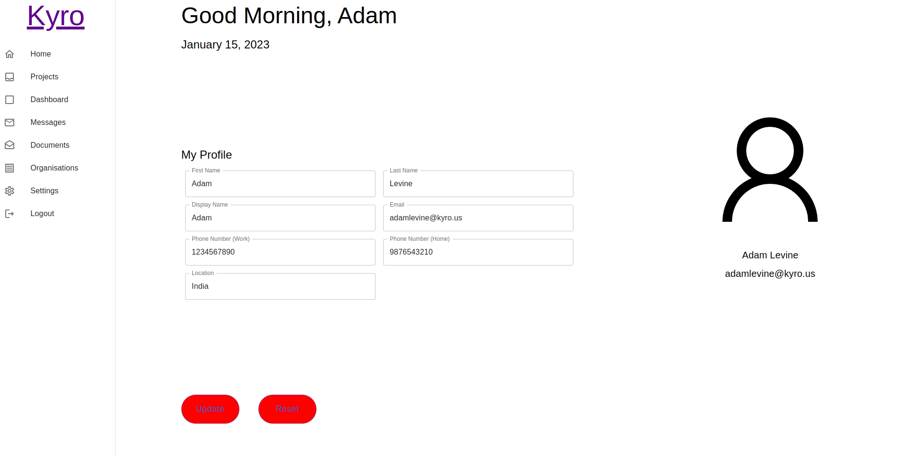

# Profile based React App

Basic Profile App where the profile can be updated. 

## Requirements

- Node - v18.13.0
- npm - v8.19.3
- Visual Code

### How to Run

- Clone the project

```sh
git clone https://github.com/MvkZ/profile-react-app.git
cd profile-react-app
```

- install the npm packages

```sh
npm install
```

- run the project

```sh
npm start
```

> make sure the spring api project is also running along this.

You can visit the following [http://localhost:8081/](http://localhost:8081/)

### Screenshots

- Sample of the working project



### TODO

- Dockerize the app
- Modularize the components into better Grid structure
- Add profile functionalities